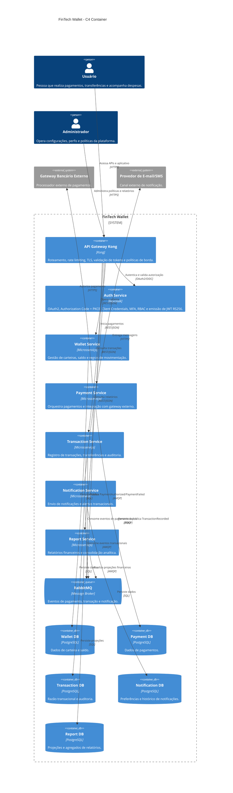

# FinTech Wallet - Arquitetura de Software Fase 3

## 1. Visão Executiva

A FinTech Wallet é uma plataforma de gestão financeira pessoal orientada a microsserviços, projetada para pagamentos, transferências, controle de despesas, notificações e relatórios financeiros. A arquitetura final prioriza segurança, disponibilidade, escalabilidade, desempenho e confiabilidade, mantendo o domínio protegido por princípios da Arquitetura Hexagonal definidos na fase anterior.

A solução combina API Gateway, microsserviços independentes, mensageria assíncrona, autenticação centralizada com Keycloak, PostgreSQL por serviço e implantação em AWS EC2 via Docker Compose. Essa escolha equilibra controle operacional, simplicidade acadêmica de execução e aderência a padrões de mercado.

Estado atual na Fase 4: o projeto encontra-se documentado como uma arquitetura de referência pronta para implementação incremental. A Fase 3 consolida as decisões arquiteturais de cloud, microsserviços, resiliência e comunicação; a visão de Fase 4 representa o estado alvo do sistema após essa evolução, com os containers, padrões e responsabilidades definidos neste repositório.

## 2. Problema de Negócio

Usuários de carteiras digitais esperam pagamentos confiáveis, baixa latência, proteção contra acessos indevidos e visibilidade clara de suas movimentações financeiras. Falhas em serviços de pagamento, autenticação ou notificação não podem comprometer toda a plataforma.

O problema arquitetural central é organizar a FinTech Wallet para crescer com segurança, isolar falhas, preservar dados financeiros sensíveis e manter a evolução independente dos módulos de negócio.

## 3. Arquitetura

A arquitetura é baseada em microsserviços, com comunicação híbrida:

- REST síncrono para autenticação, consultas, operações de carteira e chamadas que exigem resposta imediata.
- RabbitMQ assíncrono para eventos de pagamento, notificações, atualização de relatórios e integração entre serviços sem acoplamento temporal.

Microsserviços definidos:

- Wallet Service: gerencia carteiras, saldo disponível e regras de movimentação.
- Payment Service: orquestra pagamentos e integração com gateways externos.
- Transaction Service: registra transações, transferências e trilhas de auditoria financeira.
- Notification Service: envia notificações transacionais e alertas.
- Report Service: consolida dados para relatórios financeiros.
- Auth Service: Keycloak responsável por OAuth2, OpenID Connect, JWT, MFA e RBAC.

Padrões arquiteturais utilizados:

- API Gateway
- Circuit Breaker
- Bulkhead
- Database per Service
- Retry com Backoff
- Event Driven Architecture
- Arquitetura Hexagonal dentro dos serviços de domínio

## 4. Diagrama Mermaid C4 Container



## 5. Estrutura do Projeto

```text
docs/
├── adrs/
│   ├── 0001-estrategia-nuvem.md
│   ├── 0002-padrao-resiliencia.md
│   └── 0003-modelo-comunicacao.md
├── sad/
│   └── sad-fase3.md
└── diagrams/
    ├── c4-context.mmd
    └── c4-container.mmd

gold-plating/
├── threat-model.md
├── observability.md
├── deployment-view.md
├── api-governance.md
└── sequence-diagrams.md

src/
└── README.md

.gitignore
README.md
```

## 6. Como Executar Localmente

Este repositório documenta a arquitetura da solução. Uma execução local de referência pode ser feita com Docker Compose contendo Kong, Keycloak, RabbitMQ, PostgreSQL por serviço e containers dos microsserviços.

Fluxo esperado:

```bash
docker compose up -d
```

Após a subida da infraestrutura:

- Kong expõe a borda HTTP/HTTPS da plataforma.
- Keycloak publica os endpoints OAuth2/OIDC.
- RabbitMQ recebe eventos dos serviços.
- Cada microsserviço conecta apenas ao seu próprio PostgreSQL.

## 7. Links dos ADRs

- [ADR 0001 - Estratégia de Nuvem](docs/adrs/0001-estrategia-nuvem.md)
- [ADR 0002 - Padrão de Resiliência](docs/adrs/0002-padrao-resiliencia.md)
- [ADR 0003 - Modelo de Comunicação](docs/adrs/0003-modelo-comunicacao.md)

## 8. Tecnologias Utilizadas

- AWS EC2 para implantação IaaS
- Docker Compose para orquestração local e ambiente acadêmico reprodutível
- Kong como API Gateway
- Keycloak como Auth Service
- OAuth2, OpenID Connect, Authorization Code + PKCE e Client Credentials
- JWT RS256
- RabbitMQ para mensageria assíncrona
- PostgreSQL com Database per Service
- Circuit Breaker, Bulkhead e Retry com Backoff
- Mermaid para documentação visual C4

## Referências

- Newman, Sam. *Building Microservices*. O'Reilly Media.
- Newman, Sam. *Monolith to Microservices*. O'Reilly Media.
- Pressman, Roger S.; Maxim, Bruce R. *Software Engineering: A Practitioner's Approach*. McGraw-Hill.
- Nygard, Michael T. *Release It!*. Pragmatic Bookshelf.
