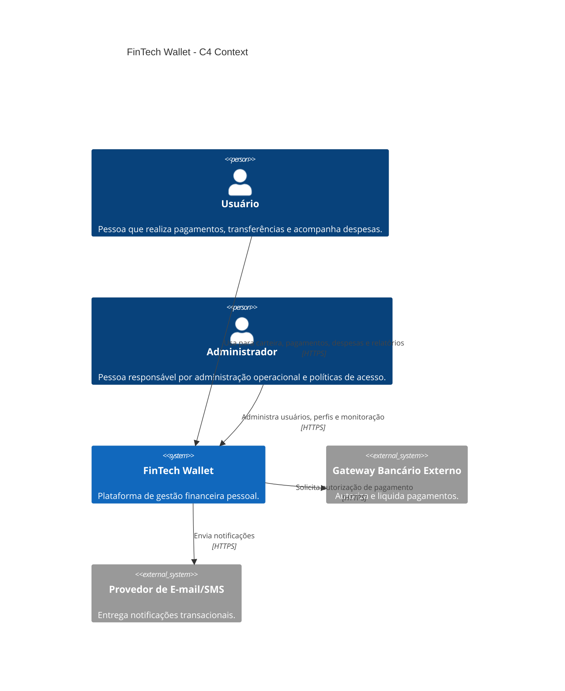

# SAD - Software Architecture Document - Fase 3

## 1. Visão Arquitetural

A FinTech Wallet é uma plataforma de gestão financeira pessoal para pagamentos, transferências, controle de despesas, notificações e relatórios financeiros. A arquitetura final documentada neste SAD adota microsserviços, comunicação híbrida REST e RabbitMQ, autenticação centralizada com Keycloak, API Gateway Kong, PostgreSQL por serviço e implantação em AWS EC2.

A decisão preserva a diretriz da Fase 2: cada microsserviço deve organizar seu núcleo de negócio com Arquitetura Hexagonal, mantendo domínio isolado de infraestrutura, frameworks, banco de dados, mensageria e provedores externos.

O objetivo arquitetural é permitir evolução independente dos módulos, reduzir impacto de falhas, proteger dados financeiros sensíveis e sustentar crescimento gradual de carga.

## 2. Estado Atual na Fase 4

Embora o artefato seja entregue no caminho solicitado pelo enunciado como `docs/sad/sad-fase3.md`, o conteúdo descreve o estado arquitetural alvo consolidado para a Fase 4: uma plataforma preparada para implementação incremental em microsserviços, com decisões de cloud, segurança, comunicação, resiliência e persistência já documentadas.

Esse estado atual não representa apenas uma intenção genérica. Ele define containers, responsabilidades, integrações, padrões de falha, fronteiras de dados e critérios de execução local. A implementação futura deve seguir esta documentação como contrato arquitetural.

## 3. Escopo

Este SAD documenta a arquitetura consolidada para a evolução da FinTech Wallet, incluindo:

- visão de contexto;
- visão de containers;
- decomposição de microsserviços;
- infraestrutura de nuvem;
- segurança;
- comunicação;
- persistência;
- resiliência;
- trade-offs arquiteturais.

Não fazem parte deste documento detalhes de implementação de código, modelo físico completo de banco de dados ou configuração final de pipeline CI/CD.

## 4. Requisitos Funcionais

RF01 - O usuário deve autenticar-se com segurança antes de acessar recursos financeiros.

RF02 - O usuário deve consultar saldo e movimentações da carteira.

RF03 - O usuário deve realizar pagamentos.

RF04 - O usuário deve realizar transferências.

RF05 - O usuário deve registrar e acompanhar despesas.

RF06 - O sistema deve emitir notificações transacionais.

RF07 - O sistema deve gerar relatórios financeiros por período e categoria.

RF08 - Administradores devem gerenciar perfis, permissões e políticas de acesso.

## 5. Requisitos Não Funcionais

### Segurança

Segurança é o RNF prioritário. A plataforma processa dados financeiros e deve proteger identidade, autorização, transporte, dados em repouso, trilhas de auditoria e integrações externas.

Decisões relacionadas:

- OAuth2 Authorization Code + PKCE para usuários finais.
- OAuth2 Client Credentials para comunicação serviço-serviço.
- JWT assinado com RS256.
- MFA para usuários sensíveis e perfis administrativos.
- RBAC centralizado no Keycloak.
- TLS na borda e nas integrações externas.
- Segregação de bancos por serviço.

### Disponibilidade

A arquitetura isola serviços para que falhas em relatórios ou notificações não interrompam pagamentos e autenticação. Circuit Breaker, Bulkhead e RabbitMQ reduzem propagação de falhas.

### Escalabilidade

Microsserviços podem ser escalados independentemente. Payment Service, Wallet Service e Transaction Service tendem a receber prioridade de escala horizontal. Report Service pode ser escalado conforme demanda analítica.

### Desempenho

O desempenho é protegido por comunicação síncrona apenas onde necessário, processamento assíncrono de eventos, separação de bancos e limitação de chamadas encadeadas.

### Confiabilidade

Confiabilidade é tratada por idempotência em consumidores, retry com backoff em operações seguras, persistência transacional por serviço, DLQs no RabbitMQ e trilhas de auditoria no Transaction Service.

## 6. Visão C4 Context

## 7. Visão C4 Container

```mermaid
C4Container
title FinTech Wallet - C4 Container

Person(user, "Usuário", "Pessoa que realiza pagamentos, transferências e acompanha despesas.")
Person(admin, "Administrador", "Opera configurações, perfis e políticas da plataforma.")

System_Boundary(fintech, "FinTech Wallet") {
  Container(kong, "API Gateway Kong", "Kong", "Roteamento, rate limiting, TLS, validação de tokens e políticas de borda.")
  Container(auth, "Auth Service", "Keycloak", "OAuth2, Authorization Code + PKCE, Client Credentials, MFA, RBAC e JWT RS256.")
  Container(wallet, "Wallet Service", "Microsserviço", "Gestão de carteiras, saldo e regras de movimentação.")
  Container(payment, "Payment Service", "Microsserviço", "Orquestra pagamentos e integração com gateway externo.")
  Container(transaction, "Transaction Service", "Microsserviço", "Registro de transações, transferências e auditoria.")
  Container(notification, "Notification Service", "Microsserviço", "Envio de notificações e alertas transacionais.")
  Container(report, "Report Service", "Microsserviço", "Relatórios financeiros e consolidação analítica.")
  ContainerQueue(rabbitmq, "RabbitMQ", "Message Broker", "Eventos de pagamento, transação e notificação.")

  ContainerDb(walletdb, "Wallet DB", "PostgreSQL", "Dados de carteira e saldo.")
  ContainerDb(paymentdb, "Payment DB", "PostgreSQL", "Dados de pagamentos.")
  ContainerDb(transactiondb, "Transaction DB", "PostgreSQL", "Razão transacional e auditoria.")
  ContainerDb(notificationdb, "Notification DB", "PostgreSQL", "Preferências e histórico de notificações.")
  ContainerDb(reportdb, "Report DB", "PostgreSQL", "Projeções e agregados de relatórios.")
}

System_Ext(bank, "Gateway Bancário Externo", "Processador externo de pagamentos.")
System_Ext(email, "Provedor de E-mail/SMS", "Canal externo de notificação.")

Rel(user, kong, "Acessa APIs e aplicativo", "HTTPS")
Rel(admin, kong, "Administra políticas e relatórios", "HTTPS")
Rel(kong, auth, "Autentica e valida autorização", "OAuth2/OIDC")
Rel(kong, wallet, "Opera carteira", "REST/JSON")
Rel(kong, payment, "Inicia pagamentos", "REST/JSON")
Rel(kong, transaction, "Consulta transações", "REST/JSON")
Rel(kong, report, "Consulta relatórios", "REST/JSON")

Rel(wallet, walletdb, "Persiste dados", "SQL")
Rel(payment, paymentdb, "Persiste dados", "SQL")
Rel(transaction, transactiondb, "Persiste dados", "SQL")
Rel(notification, notificationdb, "Persiste dados", "SQL")
Rel(report, reportdb, "Persiste projeções", "SQL")

Rel(payment, bank, "Autoriza pagamento", "HTTPS")
Rel(payment, rabbitmq, "Publica PaymentAuthorized/PaymentFailed", "AMQP")
Rel(transaction, rabbitmq, "Consome eventos de pagamento e publica TransactionRecorded", "AMQP")
Rel(notification, rabbitmq, "Consome eventos transacionais", "AMQP")
Rel(report, rabbitmq, "Atualiza projeções financeiras", "AMQP")
Rel(notification, email, "Entrega mensagens", "HTTPS")
```

## 8. Microsserviços

### Wallet Service

Responsável por carteira, saldo disponível, limites operacionais e regras de movimentação. Mantém o domínio de Conta, Carteira e regras de saldo isolado por portas e adaptadores.

Portas relacionadas:

- AccountRepository
- NotificationPort
- AuthPort

Banco: Wallet DB em PostgreSQL.

Comunicação:

- REST para operações de consulta e comandos imediatos.
- Eventos para publicação de alterações relevantes de saldo.

### Payment Service

Responsável por iniciar, validar e orquestrar pagamentos. Integra-se ao gateway bancário externo por adaptador de infraestrutura que implementa PaymentGatewayPort.

Portas relacionadas:

- PaymentGatewayPort
- NotificationPort
- AuthPort

Banco: Payment DB em PostgreSQL.

Comunicação:

- REST para receber solicitação de pagamento.
- HTTPS para gateway externo.
- RabbitMQ para eventos PaymentRequested, PaymentAuthorized e PaymentFailed.

### Transaction Service

Responsável pelo registro definitivo de transações, transferências e trilhas de auditoria financeira. Deve manter histórico imutável de eventos contábeis relevantes.

Banco: Transaction DB em PostgreSQL.

Comunicação:

- REST para consultas.
- RabbitMQ para consumo de eventos de pagamento e publicação de TransactionRecorded.

### Notification Service

Responsável por envio de e-mail, SMS, push e alertas transacionais. Não deve bloquear o fluxo principal de pagamento.

Portas relacionadas:

- NotificationPort

Banco: Notification DB em PostgreSQL.

Comunicação:

- RabbitMQ para consumo de eventos.
- HTTPS para provedores externos.

### Report Service

Responsável por relatórios financeiros, projeções, sumarizações por categoria e acompanhamento de despesas. Trabalha com projeções derivadas de eventos.

Banco: Report DB em PostgreSQL.

Comunicação:

- REST para consultas.
- RabbitMQ para atualização assíncrona das projeções.

### Auth Service - Keycloak

Responsável por autenticação, autorização, emissão de tokens, RBAC, MFA e federação futura de identidade.

Protocolos:

- OAuth2
- OpenID Connect
- JWT RS256

Fluxos:

- Authorization Code + PKCE para usuários finais.
- Client Credentials para comunicação serviço-serviço.

## 9. Arquitetura Hexagonal nos Microsserviços

Cada microsserviço de domínio deve seguir portas e adaptadores:

- Domínio: entidades, regras de negócio e casos de uso.
- Portas de entrada: comandos e consultas expostos por controllers REST ou consumidores de eventos.
- Portas de saída: repositórios, gateways externos, notificações e autenticação.
- Adaptadores: PostgreSQL, RabbitMQ, HTTP clients, Keycloak e provedores externos.

Essa organização impede que detalhes de infraestrutura contaminem regras de negócio, preservando testabilidade e evolução independente.

Entidades principais preservadas das fases anteriores:

- Usuário
- Conta
- Carteira
- Transação
- Pagamento

Portas principais preservadas:

- AccountRepository
- PaymentGatewayPort
- NotificationPort
- AuthPort

## 10. Cloud

A estratégia de nuvem escolhida é IaaS com AWS EC2.

Componentes implantados em EC2:

- Kong
- Keycloak
- RabbitMQ
- Microsserviços
- PostgreSQL por serviço

A implantação em Docker Compose permite reprodutibilidade acadêmica e facilita o entendimento da topologia. Em produção real, recomenda-se evoluir para múltiplas instâncias EC2, balanceador, volumes persistentes, backup automatizado, secrets manager e bancos gerenciados.

Trade-off principal:

- EC2 oferece controle e clareza arquitetural.
- O custo é maior responsabilidade operacional.

## 11. Segurança

### OAuth2

A plataforma usa OAuth2 com dois fluxos principais.

Authorization Code + PKCE:

- usado por usuários finais;
- reduz risco de interceptação de código de autorização;
- adequado para aplicações web e mobile modernas.

Client Credentials:

- usado em comunicação serviço-serviço;
- permite credenciais próprias por microsserviço;
- facilita aplicar escopos mínimos por integração.

### JWT RS256

Tokens JWT são assinados com RS256. A chave privada fica sob responsabilidade do Keycloak, enquanto Kong e serviços validam tokens com chave pública.

Vantagens:

- validação distribuída sem compartilhar segredo simétrico;
- rotação de chaves mais segura;
- boa aderência a OIDC e ambientes distribuídos.

### MFA

MFA é obrigatório para administradores e recomendado para usuários em operações sensíveis, como alteração de limite, cadastro de novo dispositivo e transações de alto valor.

### RBAC

RBAC define papéis como:

- USER
- PREMIUM_USER
- SUPPORT
- ADMIN
- SERVICE_PAYMENT
- SERVICE_REPORT

Cada papel recebe escopos mínimos necessários. Serviços internos não devem reutilizar credenciais de usuário para tarefas técnicas.

### API Gateway

Kong centraliza:

- roteamento;
- TLS;
- rate limiting;
- validação de JWT;
- políticas de CORS;
- controle de tamanho de payload;
- observabilidade de borda.

O gateway não substitui validações internas. Cada serviço continua responsável por autorização de domínio.

## 12. Database per Service

Cada microsserviço possui seu próprio banco PostgreSQL. Nenhum serviço acessa diretamente o banco de outro serviço.

Benefícios:

- isolamento de dados;
- autonomia de schema;
- menor acoplamento entre serviços;
- possibilidade de escalar armazenamento por domínio.

Consequências:

- joins entre domínios deixam de ser consultas diretas;
- relatórios dependem de projeções e eventos;
- consistência eventual precisa ser aceita em dados derivados.

## 13. Comunicação

### REST

Usado para:

- autenticação;
- consultas;
- comandos de resposta imediata;
- comunicação da borda com serviços internos.

### RabbitMQ

Usado para:

- notificações;
- eventos de pagamento;
- atualização de relatórios;
- integração assíncrona entre serviços.

Eventos principais:

- PaymentRequested
- PaymentAuthorized
- PaymentFailed
- TransactionRecorded
- WalletBalanceChanged
- NotificationRequested

Cada evento deve ter:

- eventId;
- eventType;
- occurredAt;
- correlationId;
- causationId;
- producer;
- schemaVersion;
- payload.

## 14. Circuit Breaker

Circuit Breaker será aplicado a dependências remotas críticas:

- Payment Service para gateway bancário;
- Notification Service para provedor externo;
- Kong para serviços internos;
- serviços internos quando chamarem APIs REST entre si.

O objetivo é evitar falhas em cascata e aplicar fail fast quando uma dependência está degradada.

Estados esperados:

- Closed: chamadas permitidas.
- Open: chamadas bloqueadas temporariamente.
- Half-open: chamadas de teste para verificar recuperação.

## 15. Bulkhead

Bulkhead separa recursos por fluxo e dependência.

Exemplos:

- pool de conexões separado para gateway bancário;
- fila ou worker dedicado para notificações;
- limites específicos para relatórios;
- timeouts diferentes por tipo de operação.

Isso impede que relatórios pesados ou notificações atrasadas esgotem recursos necessários para pagamento e autenticação.

## 16. Retry com Backoff

Retry com backoff será usado apenas em operações idempotentes. Pagamentos exigem chave de idempotência antes de qualquer retry.

Regras:

- número máximo de tentativas;
- backoff exponencial;
- jitter para evitar sincronização de retries;
- timeout global por operação;
- logs e métricas por tentativa.

## 17. Observabilidade

A observabilidade mínima inclui:

- logs estruturados;
- correlation ID em HTTP e AMQP;
- métricas de APIs, filas, bancos e circuit breakers;
- tracing distribuído;
- dashboards por serviço;
- alertas para DLQ, erro 5xx, latência alta e fila acumulada.

Sem observabilidade, os padrões de resiliência se tornam difíceis de operar com segurança.

## 18. Trade-offs Arquiteturais

### Microsserviços vs Monólito

Microsserviços aumentam autonomia, escalabilidade independente e isolamento de falhas. Em troca, aumentam complexidade de rede, observabilidade, deploy e consistência.

A escolha é justificada porque a FinTech Wallet possui domínios com ritmos de evolução diferentes: pagamento, carteira, transação, notificação, relatório e autenticação.

### REST vs Mensageria

REST simplifica interações imediatas, mas cria acoplamento temporal. RabbitMQ reduz acoplamento, mas introduz consistência eventual.

O modelo híbrido usa cada abordagem onde ela é mais adequada.

### Database per Service vs Banco Compartilhado

Database per Service protege autonomia e isolamento, mas dificulta relatórios e consultas cruzadas.

O Report Service resolve esse problema com projeções derivadas de eventos.

### EC2 vs PaaS/Serverless

EC2 oferece controle e clareza de topologia. PaaS e Serverless reduzem operação, mas ocultam decisões importantes e podem limitar a execução completa da arquitetura proposta.

## 19. Custo vs Desempenho

A arquitetura permite otimizar custo e desempenho por serviço.

Serviços críticos, como Payment Service, Wallet Service e Transaction Service, devem receber maior prioridade de CPU, memória, limites de conexão e escala. Serviços menos críticos, como Report Service e Notification Service, podem usar processamento assíncrono e recursos menores.

Trade-offs:

- Instâncias maiores reduzem latência, mas aumentam custo fixo.
- Escala horizontal melhora disponibilidade, mas exige balanceamento e observabilidade.
- PostgreSQL por serviço aumenta isolamento, mas consome mais recursos.
- RabbitMQ melhora absorção de picos, mas adiciona operação e monitoramento.

## 20. Riscos e Mitigações

| Risco | Impacto | Mitigação |
|---|---:|---|
| Falha do gateway bancário | Alto | Circuit Breaker, timeout, retry controlado e fallback operacional |
| Duplicidade de pagamento | Alto | Idempotency key, transações locais e auditoria |
| Vazamento de token | Alto | JWT curto, RS256, TLS, rotação de chaves e MFA |
| Fila acumulada | Médio | Alertas, DLQ, consumidores escaláveis e backpressure |
| Banco de serviço indisponível | Alto | backup, health checks e estratégia de recuperação |
| Relatórios inconsistentes | Médio | consistência eventual documentada e reprocessamento de eventos |

## 21. Conclusão

A arquitetura da FinTech Wallet adota microsserviços com fronteiras claras, domínio protegido por Arquitetura Hexagonal, segurança centralizada com Keycloak, comunicação híbrida e padrões explícitos de resiliência.

A solução atende aos RNFs prioritários ao combinar isolamento, autenticação forte, mensageria assíncrona, banco por serviço, Circuit Breaker, Bulkhead e implantação controlada em AWS EC2. As decisões assumem trade-offs reais: maior complexidade operacional em troca de melhor isolamento, escalabilidade e rastreabilidade para uma plataforma financeira.

## Referências

- Pressman, Roger S.; Maxim, Bruce R. *Software Engineering: A Practitioner's Approach*. McGraw-Hill.
- Newman, Sam. *Building Microservices*. O'Reilly Media.
- Newman, Sam. *Monolith to Microservices*. O'Reilly Media.
- Nygard, Michael T. *Release It!*. Pragmatic Bookshelf.
