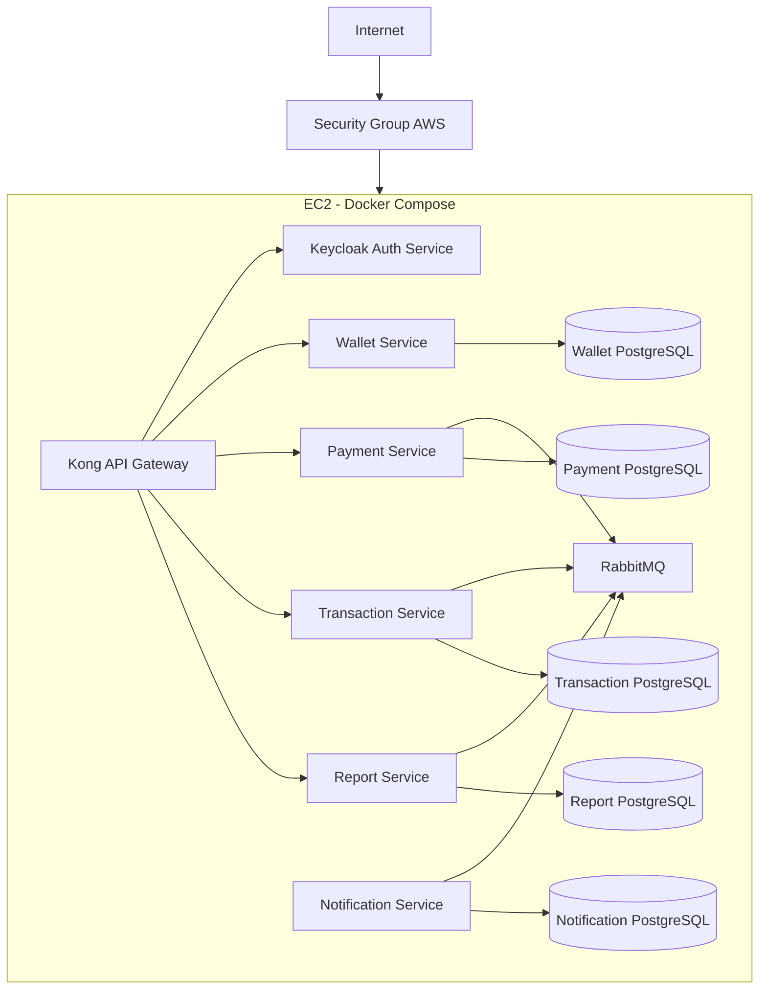

# Deployment View - FinTech Wallet

## 1. Contexto

A Fase 3 adota AWS EC2 como estratégia IaaS. O objetivo é demonstrar a arquitetura completa em ambiente controlado, com Docker Compose executando Kong, Keycloak, RabbitMQ, PostgreSQL por serviço e microsserviços da FinTech Wallet.

Essa visão de implantação documenta a topologia de referência, responsabilidades operacionais, decisões, alternativas rejeitadas e evolução recomendada.

## 2. Topologia de Referência

## 3. Decisão

A implantação de referência será feita em uma instância AWS EC2 com Docker Compose. Cada componente roda em container próprio e cada microsserviço possui seu próprio PostgreSQL.

Decisões:

- Kong é o único ponto público de entrada.
- Keycloak, RabbitMQ, PostgreSQL e microsserviços ficam em rede privada do Docker.
- Bancos usam volumes persistentes.
- Variáveis sensíveis devem ser injetadas por ambiente e não versionadas.
- Health checks devem ser definidos para gateway, auth, broker, bancos e serviços.

## 4. Alternativas Rejeitadas

### PaaS

Rejeitado para esta fase porque reduziria a visibilidade da topologia e poderia esconder decisões importantes de rede, banco por serviço e mensageria.

### Serverless

Rejeitado como modelo principal porque fluxos financeiros e comunicação entre serviços exigem controle de runtime, conexão com broker, idempotência e rastreabilidade contínua.

### Kubernetes

Rejeitado para a Fase 3 por complexidade adicional. Kubernetes seria tecnicamente adequado, mas adicionaria objetos, operadores, ingress, secrets, probes e manifests que desviam o foco da disciplina. Pode ser evolução futura.

## 5. Portas e Exposição

| Componente | Exposição | Observação |
|---|---|---|
| Kong | Pública | Entrada HTTPS da plataforma |
| Keycloak | Restrita ou via Kong | Administração protegida |
| RabbitMQ | Privada | Console administrativo restrito |
| PostgreSQL | Privada | Acesso apenas do serviço dono |
| Microsserviços | Privada | Expostos apenas ao Kong |

## 6. Responsabilidades Operacionais

### Sistema Operacional EC2

- aplicar patches;
- configurar firewall;
- manter Docker atualizado;
- monitorar disco, CPU e memória;
- configurar logs do host.

### Containers

- versionar imagens;
- definir health checks;
- limitar CPU e memória;
- configurar restart policy;
- coletar logs.

### Dados

- volumes persistentes;
- backup periódico;
- teste de restauração;
- criptografia de disco;
- política de retenção.

## 7. Estratégia de Ambientes

Ambientes recomendados:

- local: Docker Compose em máquina do desenvolvedor;
- staging: EC2 com dados sintéticos;
- produção: múltiplas EC2 ou evolução para orquestração gerenciada.

Separações obrigatórias:

- clients OAuth2 diferentes por ambiente;
- secrets diferentes;
- bancos isolados;
- filas isoladas;
- domínios e certificados separados.

## 8. Evolução para Produção

Para produção real, a topologia deve evoluir:

- Application Load Balancer antes do Kong;
- múltiplas instâncias EC2;
- Auto Scaling Group;
- RDS PostgreSQL por serviço ou clusters separados;
- RabbitMQ gerenciado ou cluster com alta disponibilidade;
- secrets em AWS Secrets Manager;
- imagens em registry privado;
- backups automatizados;
- WAF na borda.

## 9. Consequências

Consequências positivas:

- Alta clareza da arquitetura implantada.
- Ambiente simples de reproduzir.
- Controle sobre rede, containers e dependências.
- Boa aderência à entrega acadêmica.

Consequências negativas:

- EC2 concentra responsabilidade operacional.
- Docker Compose não oferece orquestração avançada.
- Alta disponibilidade exige evolução posterior.

## 10. Trade-offs

A decisão privilegia controle e legibilidade sobre automação sofisticada. Kubernetes, PaaS e serviços gerenciados poderiam aumentar robustez, mas também elevariam a complexidade da entrega. Para Fase 3, EC2 com Docker Compose expressa melhor as decisões arquiteturais centrais.

## 11. Referências

- Newman, Sam. *Building Microservices*. O'Reilly Media.
- Pressman, Roger S.; Maxim, Bruce R. *Software Engineering: A Practitioner's Approach*. McGraw-Hill.
