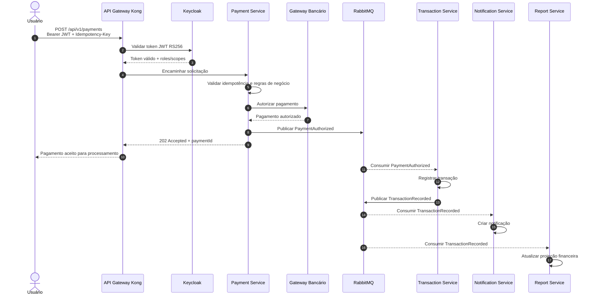
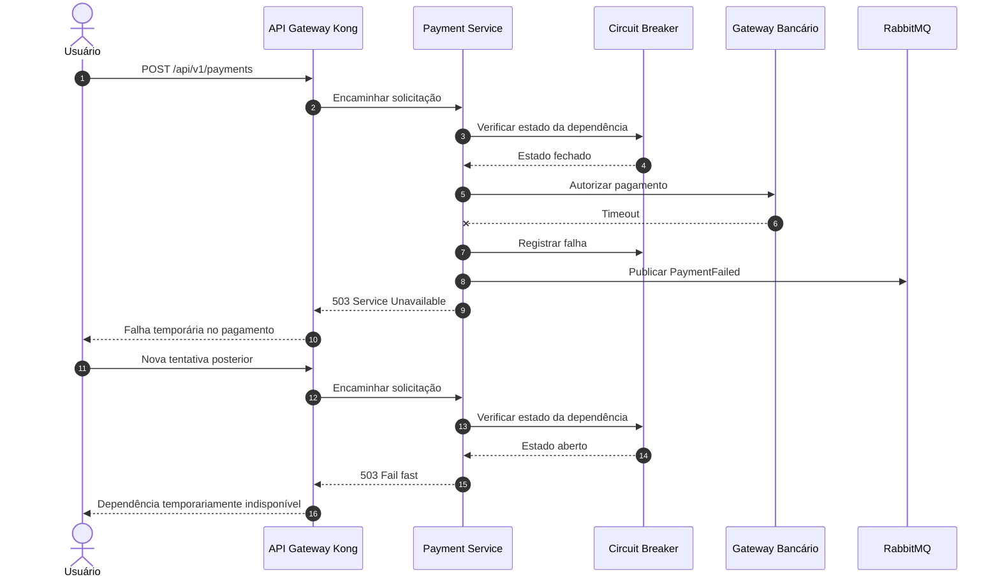
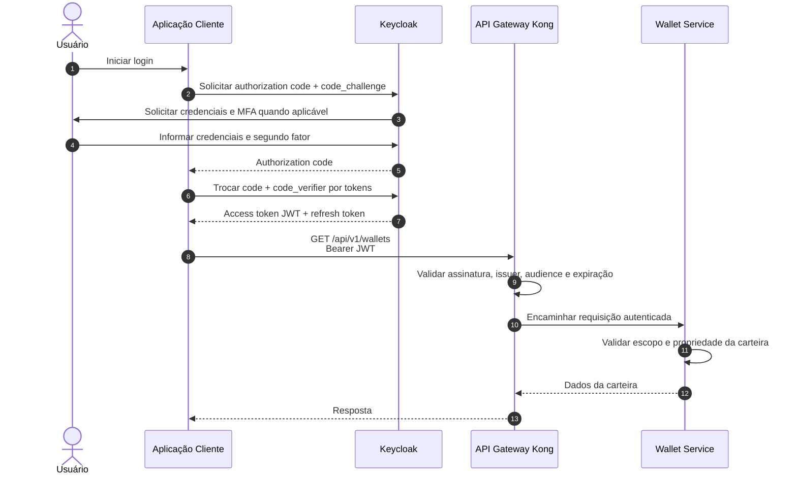
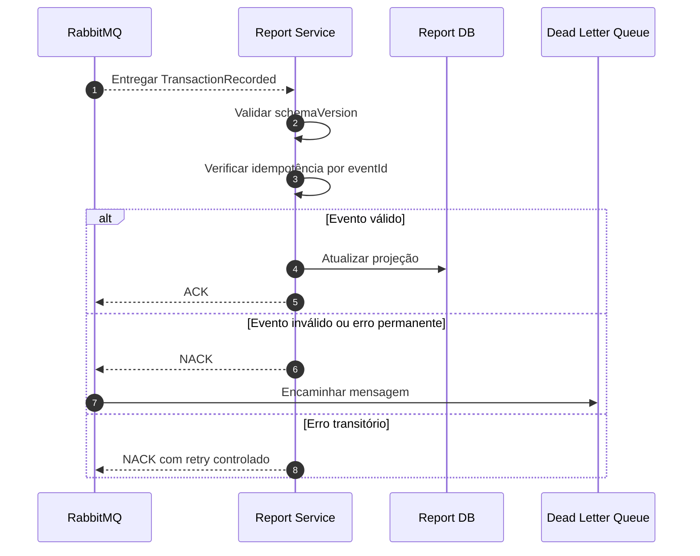

# Sequence Diagrams - FinTech Wallet

## 1. Contexto

Os diagramas de sequência mostram como a arquitetura se comporta em tempo de execução. Eles complementam C4 Context e C4 Container ao evidenciar chamadas REST, eventos RabbitMQ, autenticação, consistência eventual, idempotência e tratamento de falhas.

## 2. Decisão

A documentação dinâmica da FinTech Wallet usará diagramas de sequência Mermaid para os fluxos críticos de pagamento, autenticação, falha de dependência e atualização assíncrona de relatório.

Essa decisão foi tomada porque diagramas de sequência tornam explícitos os limites entre comunicação síncrona e assíncrona, mostram onde políticas de segurança são aplicadas e ajudam a validar responsabilidades dos microsserviços.

## 3. Alternativas Rejeitadas

### Documentar apenas C4 Container

Rejeitado porque C4 Container mostra estrutura, mas não mostra ordem temporal, tratamento de falhas, publicação de eventos ou pontos de validação de token.

### Descrever fluxos apenas em texto

Rejeitado porque fluxos financeiros possuem múltiplos participantes e efeitos assíncronos. Texto puro dificulta visualizar latência, consistência eventual e responsabilidades operacionais.

## 4. Trade-offs Consolidados

Diagramas de sequência exigem manutenção sempre que contratos ou fluxos mudam. Em troca, reduzem ambiguidade e tornam decisões arquiteturais auditáveis. Para a FinTech Wallet, esse custo é aceitável porque pagamento, autenticação e eventos financeiros são fluxos críticos.

## 5. Pagamento Autorizado

### Decisões Representadas

- REST é usado no comando iniciado pelo usuário.
- RabbitMQ desacopla registro, notificação e relatório.
- `Idempotency-Key` protege contra duplicidade.
- O retorno `202 Accepted` comunica processamento assíncrono.

### Trade-off

O usuário recebe confirmação de aceitação antes de todos os efeitos derivados terminarem. Isso melhora disponibilidade e desempenho percebido, mas exige consistência eventual e observabilidade dos eventos.

## 6. Falha no Gateway Bancário com Circuit Breaker

### Decisões Representadas

- Circuit Breaker evita insistência contra uma dependência degradada.
- Falha é registrada por evento para auditoria e notificação.
- O serviço falha rapidamente quando o circuito está aberto.

### Alternativa Rejeitada

Repetir indefinidamente a chamada ao gateway bancário foi rejeitado porque aumenta latência, consome recursos e pode causar falha em cascata.

## 7. Login com Authorization Code + PKCE

### Decisões Representadas

- Authorization Code + PKCE reduz risco de interceptação.
- MFA protege operações e perfis sensíveis.
- Kong valida o token na borda.
- O serviço valida autorização de domínio.

## 8. Atualização de Relatório por Evento

### Decisões Representadas

- Report Service aceita consistência eventual.
- Consumidor é idempotente.
- DLQ preserva mensagens problemáticas.

## 9. Consequências

Consequências positivas:

- Fluxos críticos ficam explícitos.
- Os trade-offs de comunicação híbrida são visíveis.
- Sequências ajudam a validar responsabilidades dos serviços.
- Falhas são tratadas como parte do desenho, não como exceção informal.

Consequências negativas:

- A arquitetura exige correlação entre chamadas REST e eventos AMQP.
- Testes end-to-end precisam cobrir processamento assíncrono.
- Operação precisa monitorar filas, retries e DLQs.

## 10. Referências

- Newman, Sam. *Building Microservices*. O'Reilly Media.
- Nygard, Michael T. *Release It!*. Pragmatic Bookshelf.
